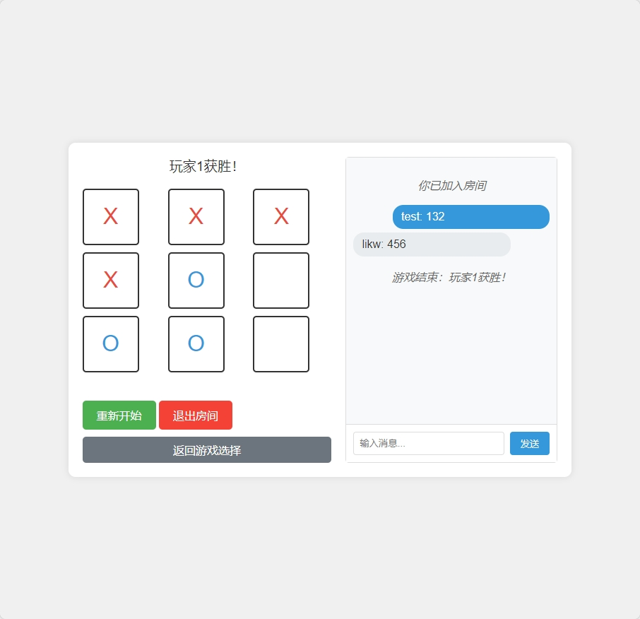
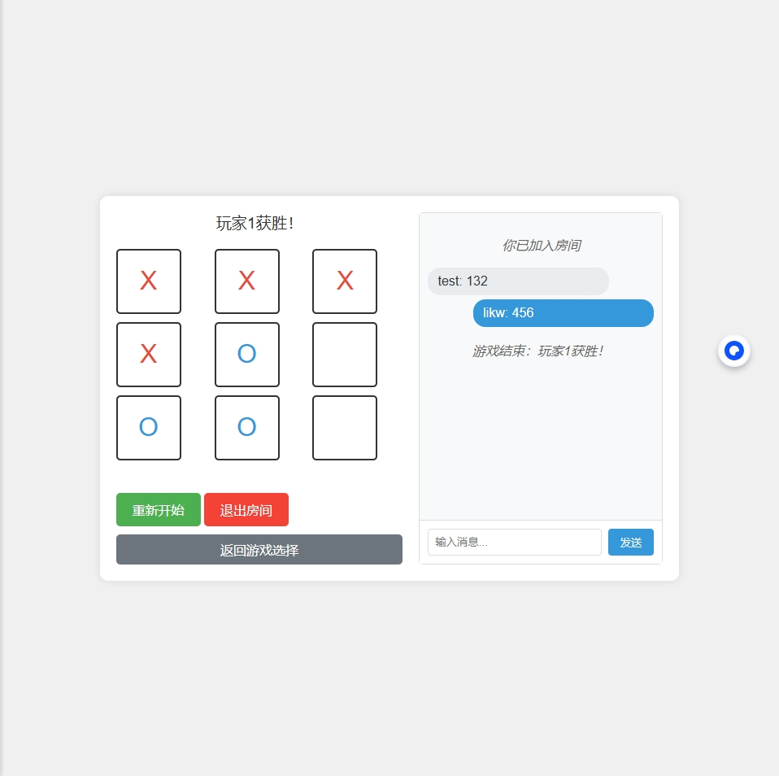

# SocketGames

一个基于WebSocket的多人在线游戏平台，支持多种棋类游戏。

## 当前支持的游戏

- 井字棋（Tic-Tac-Toe）
- 五子棋（Gomoku）- 开发中

## 项目结构

```
SocketGames/
├── common/             # 共享的工具和类
│   └── game_base.py    # 游戏基类
├── games/              # 游戏实现
│   ├── tictactoe/      # 井字棋游戏
│   │   └── game.py     # 井字棋游戏逻辑
│   └── gomoku/         # 五子棋游戏（开发中）
├── server/             # 服务器代码
│   └── server.py       # 主服务器
├── static/             # 静态文件
│   └── index.html      # 前端页面
├── users.json          # 用户数据
├── requirements.txt    # 项目依赖
└── README.md          # 项目说明
```

## 安装

1. 确保已安装Python 3.8或更高版本
2. 安装依赖：
   ```bash
   pip install -r requirements.txt
   ```

## 运行

1. 启动服务器：
   ```bash
   python app.py
   ```
2. 访问游戏：
   - 本机访问：http://localhost:8080
   - 局域网访问：http://<本机IP>:8080

## 功能特性

- 用户注册和登录
- 实时房间列表
- 多人游戏支持
- 实时游戏状态同步
- 断线重连支持

## 开发计划

- [x] 井字棋游戏
- [ ] 五子棋游戏
- [ ] 更多游戏支持
- [ ] 游戏回放功能
- [ ] 排行榜系统

## 功能特点

- 多人在线对战
- 实时聊天
- 房间系统
- 支持多种游戏（开发中）

## 游戏列表

1. 井字棋（已实现）
2. 五子棋（开发中）
3. 贪吃蛇（开发中）

## 界面预览





## 安装说明

1. 克隆仓库：
```bash
git clone https://github.com/yourusername/SocketGames.git
cd SocketGames
```

2. 安装依赖：
```bash
pip install -r requirements.txt
```

3. 运行服务器：
```bash
python app.py
```

4. 在浏览器中访问：
```
http://localhost:8080
```

## 技术栈

- 后端：Python + WebSocket
- 前端：HTML + CSS + JavaScript

## 开发计划

- [x] 用户系统
- [x] 房间系统
- [x] 井字棋游戏
- [ ] 五子棋游戏
- [ ] 贪吃蛇游戏
- [ ] 排行榜系统
- [ ] 好友系统

## 贡献指南

欢迎提交Issue和Pull Request！

## 许可证

MIT License 